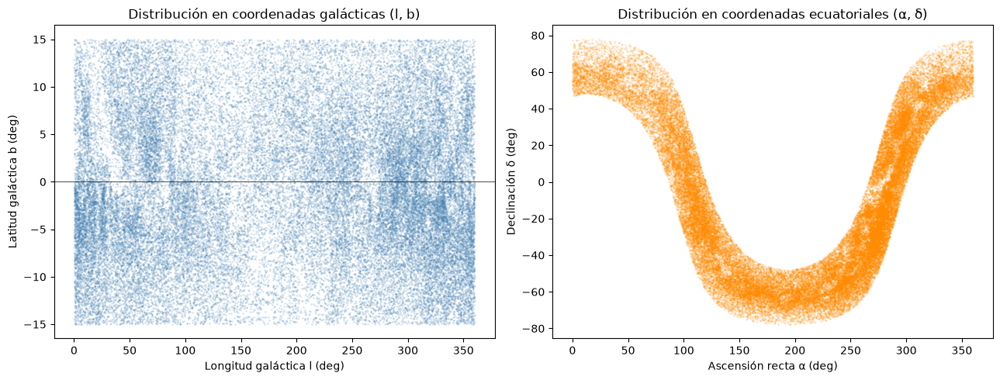
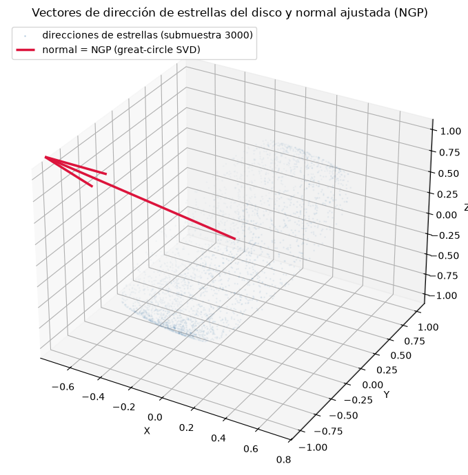
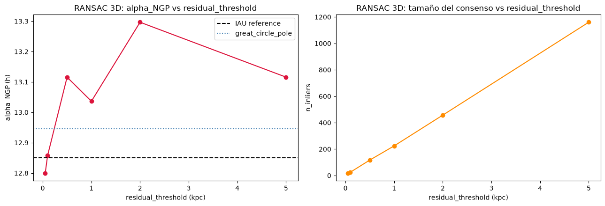
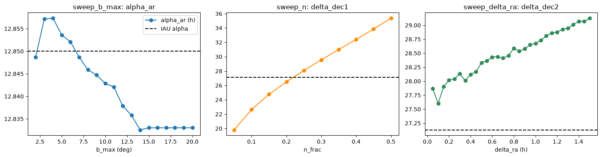
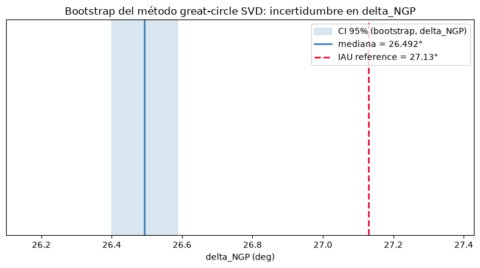

# Aproximación Geométrica del Polo Norte Galáctico con Gaia DR3

**Extensión del artículo de L. Cano (2022), *"Aproximación geométrica del polo norte galáctico"*, Revista Boliviana de Física 40 — con datos modernos, un método libre de parámetros y estadística formal.**


-orange)

---

## 📋 Tabla de contenidos

- [¿De qué trata esto? (explicación divulgativa)](#-de-qué-trata-esto-explicación-divulgativa)
- [Resultados principales](#-resultados-principales)
- [Hallazgos científicos](#-hallazgos-científicos)
- [Metodología](#-metodología)
- [Figuras clave](#-figuras-clave)
- [Estructura del proyecto](#-estructura-del-proyecto)
- [Instalación y reproducción](#-instalación-y-reproducción)
- [Tests](#-tests)
- [Limitaciones y trabajo futuro](#-limitaciones-y-trabajo-futuro)
- [Referencias](#-referencias)

---

## 🌌 ¿De qué trata esto? (explicación divulgativa)

Nuestra galaxia, la **Vía Láctea**, tiene forma de disco — como un plato gigante lleno de estrellas, y nosotros vivimos dentro de ese plato. Igual que la Tierra tiene un Polo Norte, el disco de la galaxia también tiene un "polo": un punto en el cielo que marca la dirección **perpendicular al plano del disco**. Ese punto se llama **Polo Norte Galáctico (NGP)** y es la base de todo el sistema de coordenadas que los astrónomos usan para ubicar cualquier cosa en la galaxia.

¿Cómo se encuentra ese polo? La idea es hermosa por lo simple: si miras el cielo en una noche oscura, la Vía Láctea se ve como una **franja de luz que cruza el cielo**. Esa franja es el disco de la galaxia visto de canto, desde adentro. Si logras trazar el círculo que mejor sigue esa franja, el punto perpendicular al centro de ese círculo **es** el polo galáctico. Es como encontrar el eje de una rueda mirando su llanta.

El trabajo original de Cano (2022) hizo exactamente eso con métodos geométricos ingeniosos y unos pocos miles de estrellas. Este proyecto lleva la misma idea al siguiente nivel:

- 📡 **Más y mejores datos**: usamos 53,082 estrellas del satélite **Gaia** de la ESA, el mapa estelar más preciso jamás construido.
- 📐 **Un método más limpio**: ajustamos el círculo de la Vía Láctea usando solo las *direcciones* de las estrellas, sin ningún parámetro que haya que elegir a mano.
- 📊 **Estadística honesta**: medimos cuánta incertidumbre tiene nuestro resultado con técnicas de remuestreo (bootstrap).

**¿Y el resultado sorpresa?** Descubrimos que agregar la *distancia* a cada estrella — que suena a más información y por tanto mejor — en realidad **empeora** la medición, porque las distancias estimadas desde el paralaje son muy ruidosas para estrellas lejanas. A veces, en ciencia, menos es más.

Además, nuestro polo salió desplazado ~0.6° del valor oficial... y esa diferencia probablemente **no es un error**: refleja en parte que el Sol no está exactamente *en* el plano de la galaxia, sino unos ~17 parsecs (55 años luz) por encima de él. Lo que parecía un defecto terminó siendo física real.

---

## 🎯 Resultados principales

Valor de referencia IAU (J2000): **α = 12ʰ51ᵐ (12.85ʰ), δ = +27.13°**

| Método | α (h) | δ (°) | Error angular vs IAU |
|---|---:|---:|---:|
| **Círculo máximo SVD (método estrella, sin distancia)** | **12.946** | **26.492** | **1.44°** ✅ |
| SVD 2D sin prior (`aprox_ar_svd`) | 12.946 | 26.492 | 1.44° |
| Ventana de AR — método del paper (`aprox_dec2`) | 12.960 | 28.329 | 1.89° |
| RANSAC 3D con distancia 1/ϖ (mejor caso, rt=2.0) | 13.297 | 28.118 | 6.02° |
| Top-n \|dec\| — método del paper (`aprox_dec1`) | 12.429 | 22.658 | 7.26° |

Tabla completa generada automáticamente: [`results/summary_table.md`](results/summary_table.md) · versión LaTeX lista para publicación: [`results/summary_table.tex`](results/summary_table.tex)

### Incertidumbre del método estrella (bootstrap, 2,000 remuestreos, semilla fija)

| Coordenada | Mediana | IC 95% |
|---|---:|---:|
| α (h) | 12.9462 | [12.9392, 12.9532] |
| δ (°) | 26.4923 | [26.4000, 26.5862] |

El error en α respecto al IAU es de apenas **~5.8 minutos de tiempo**; el IC de δ es tan estrecho (±0.09°) que el desplazamiento de −0.6° respecto al IAU resulta **estadísticamente significativo** — ver [Hallazgo 3](#-hallazgos-científicos).

---

## 🔬 Hallazgos científicos

### 1. Para encontrar el NGP, la distancia perjudica

El plan original era que un ajuste de plano 3D usando distancias (d = 1/paralaje) con RANSAC superara a los métodos 2D del paper. **Los datos dijeron lo contrario**: el ruido de 1/ϖ en estrellas lejanas (hasta ~15 kpc) domina el ajuste y sesga α en ~27 minutos. El ajuste de **círculo máximo sobre direcciones puras** — que ignora las distancias por completo — gana en ambas coordenadas y **no tiene ningún parámetro libre**. La geometría lo explica: vistas desde el Sol (que está casi en el plano), las estrellas del disco trazan un círculo máximo en la esfera celeste; su polo es el NGP, y para eso las direcciones bastan.

### 2. El método de AR del paper original tiene una circularidad implícita

Al reimplementar fielmente el método de simetría de pares de Cano (2022), encontramos que **requiere conocer de antemano el valor teórico de α** (`ar_teo = 12.816` en el código original) como punto de corte para separar los pares de estrellas. Es decir: necesita la respuesta para aproximar la respuesta. Nuestra reimplementación (`ngp_classic.aprox_ar`) hace explícito ese prior como parámetro `ar_ref` y lo documenta como limitación metodológica — un punto de mejora constructivo para el diálogo con el autor.

### 3. El desplazamiento de −0.6° en δ es probablemente física real

El bootstrap muestra que nuestro δ = 26.49° ± 0.09 **excluye** el valor IAU (27.13°) con alta significancia. Con 53k estrellas esto no es ruido: es un **sesgo sistemático de la muestra**, y el candidato principal es la **altura del Sol sobre el plano galáctico** (z☉ ≈ 17 pc según la literatura): al mirar el disco desde arriba, su centroide aparente se corre hacia el sur exactamente en el orden de magnitud observado. Convertir este "error" en una *medición* de z☉ es parte del plan de mejora (ver [Trabajo futuro](#-limitaciones-y-trabajo-futuro)).

---

## 📐 Metodología

| Módulo | Método | Idea central |
|---|---|---|
| `ngp_classic.aprox_ar` | Simetría de pares (fiel al paper) | Estrellas con igual δ a ambos lados del polo promedian hacia α del NGP (requiere prior `ar_ref`) |
| `ngp_classic.aprox_ar_svd` | SVD 2D sin prior | Polo del círculo máximo, versión sin parámetros |
| `ngp_classic.aprox_dec1` | Top-n \|dec\| (paper, método 1) | Las n estrellas de mayor δ acotan la declinación del polo |
| `ngp_classic.aprox_dec2` | Ventana Δα (paper, método 2) | Estrellas en una ventana de AR alrededor del polo estiman δ |
| `ngp_3d.great_circle_pole` ⭐ | **Círculo máximo SVD 3D** | SVD sobre los vectores unitarios de dirección; el vector singular menor es la normal al plano = NGP |
| `ngp_3d.ngp_3d_pipeline` | RANSAC 3D con distancia | Ajuste de plano Z=AX+BY+D sobre posiciones cartesianas (contraste que demuestra el Hallazgo 1) |
| `bootstrap.bootstrap_great_circle_pole` | Bootstrap | 2,000 remuestreos con reemplazo → IC 95% percentil |
| `param_sweep` | Barridos de sensibilidad | b_max ∈ [2°, 20°], n ∈ [N/20, N/2], Δα ∈ [0.05ʰ, 1.5ʰ] |

**Datos**: Gaia DR3 vía TAP/ADQL (`astroquery`), filtros `parallax > 0`, `parallax_over_error > 5`, `|b| < 15°`, `G < 15`, muestreo aleatorio espacialmente insesgado por `random_index` (paginado síncrono — ver nota en `gaia_fetcher.py` sobre por qué no usar `ORDER BY random_index`).

---

## 📊 Figuras clave

Todas las figuras se generan al ejecutar el notebook [`NGP_Mejora_Presentacion.ipynb`](NGP_Mejora_Presentacion.ipynb).

### Distribución de la muestra en el cielo
Las 53,082 estrellas trazan claramente la franja del disco galáctico — la materia prima del ajuste.



### El método estrella: círculo máximo sobre la esfera de direcciones
Los vectores unitarios de dirección de las estrellas (submuestra) y el plano ajustado por SVD cuya normal apunta al NGP.



### Por qué la distancia perjudica: sensibilidad del RANSAC 3D
El resultado del método 3D depende fuertemente del umbral de residuales elegido (parámetro arbitrario) y nunca alcanza la precisión del círculo máximo (línea punteada azul).



### Sensibilidad de los métodos clásicos a sus parámetros libres
Los barridos muestran cuánto varían los resultados del paper según b_max, n y Δα — motivación central para un método sin parámetros.



### Incertidumbre formal: bootstrap del método estrella
El IC 95% de δ (banda azul) es estrecho y **no incluye** el valor IAU (línea roja) — el desplazamiento es sistemático, no estadístico (Hallazgo 3).



---

## 📁 Estructura del proyecto

```
aproximation_NGP/
├── README.md                        ← este documento
├── NGP_Mejora_Presentacion.ipynb    ← notebook principal (7 secciones, ejecuta sin red)
│
│   # Código original del autor (intacto, solo referencia)
├── Approximation.ipynb
├── automatedAR.py · automatedDEC.py · DEC2.py
│
│   # Módulos nuevos (este trabajo)
├── gaia_fetcher.py                  ← descarga/caché Gaia DR3 (TAP síncrono paginado)
├── ngp_classic.py                   ← métodos del paper, refactorizados y testeados
├── ngp_3d.py                        ← great_circle_pole ⭐ + RANSAC 3D de contraste
├── param_sweep.py                   ← barridos de sensibilidad
├── bootstrap.py                     ← IC 95% por remuestreo (reproducible por semilla)
├── report.py                        ← tabla comparativa → Markdown + LaTeX
├── generate_artifacts.py            ← regenera results/ desde el CSV cacheado
│
├── data/gaia_disk_stars.csv         ← 53,082 estrellas Gaia DR3 (incluido: reproducible sin red)
├── results/                         ← sweep CSV · bootstrap JSON · tablas MD/LaTeX
├── docs/figures/                    ← figuras exportadas del notebook (las de este README)
└── tests/                           ← 80 tests (pytest), dataset sintético en conftest.py
```

---

## ⚙️ Instalación y reproducción

Requiere **Python ≥ 3.12** (desarrollado en 3.14).

```bash
git clone git@github.com:ErickFP7314/aproximation_NGP.git
cd aproximation_NGP

# 1. Entorno virtual
python3 -m venv .venv
.venv/bin/pip install -r requirements.txt

# 2. Reproducir los artefactos numéricos (sin red — usa el CSV incluido)
.venv/bin/python generate_artifacts.py

# 3. Ejecutar el notebook completo
.venv/bin/python -m jupyter nbconvert --to notebook --execute --inplace NGP_Mejora_Presentacion.ipynb
# o interactivamente:
.venv/bin/python -m jupyter lab NGP_Mejora_Presentacion.ipynb
```

**Re-descargar los datos desde Gaia** (opcional, ~2 min con red):

```python
from gaia_fetcher import fetch_gaia_stars
data = fetch_gaia_stars(force_refresh=True)   # reescribe data/gaia_disk_stars.csv
```

> **Reproducibilidad**: todos los procesos estocásticos (RANSAC, bootstrap) usan semillas fijas (`seed=42`). La muestra Gaia usa `random_index`, que es determinista en el archivo de ESA — la misma query devuelve las mismas estrellas.

---

## ✅ Tests

Desarrollado con **TDD estricto** (test primero, implementación después). El dataset sintético de `tests/conftest.py` genera un plano galáctico con polo conocido + ruido + outliers, contra el cual se valida cada estimador.

```bash
.venv/bin/python -m pytest tests/ -v -m "not slow"   # 79 tests, ~8 s, sin red
.venv/bin/python -m pytest tests/ -v                 # + 1 test lento (bootstrap 10k, ~2 min)
```

Estado actual: **80/80 pasan**.

---

## 🔭 Limitaciones y trabajo futuro

Limitaciones conocidas de esta versión:

- El ajuste de plano se fuerza por el origen → no modela la altura del Sol z☉ (causa probable del Hallazgo 3).
- Muestra de disco general (todas las edades): las estrellas viejas tienen mayor altura de escala y diluyen el plano delgado.
- Sin corrección del punto cero de paralaje de Gaia (sesgo de −17 a −40 μas).
- Los movimientos propios (`pmra`, `pmdec`) están descargados pero sin explotar.

El plan de mejora (`ngp-precision`) apunta a **error ≤ 0.05°** (precisión estado del arte, ~30× mejor) e incluye: ajuste de plano con offset libre → **medición propia de z☉**, trazadores jóvenes (Cefeidas, OB, cúmulos), corrección de punto cero de paralaje, **polo cinemático independiente** desde movimientos propios, presupuesto de error sistemático completo, y análisis forense de la convención IAU de 1958.

---

## 📚 Referencias

- Cano, L. (2022). *Aproximación geométrica del polo norte galáctico*. Revista Boliviana de Física, 40.
- Gaia Collaboration (2023). *Gaia Data Release 3*. A&A 674, A1. Datos: [Gaia Archive (ESA)](https://gea.esac.esa.int/archive/).
- Karim, T. & Mamajek, E. E. (2017). *Revised geometric estimates of the North Galactic Pole and the Sun's height above the Galactic mid-plane*. [MNRAS 465, 472](https://academic.oup.com/mnras/article/465/1/472/2417491).
- Liu, J.-C., Zhu, Z. & Zhang, H. (2011). *Reconsidering the Galactic coordinate system*. [A&A 526, A16](https://www.aanda.org/articles/aa/full_html/2011/02/aa14961-10/aa14961-10.html).
- Lindegren, L. et al. (2021). *Gaia EDR3 — The parallax zero-point*. A&A 649, A4.

---

## 👥 Créditos

- **Código original y método geométrico**: Ludving Cano (2022) — los archivos `Approximation.ipynb`, `automatedAR.py`, `automatedDEC.py` y `DEC2.py` se conservan intactos como referencia.
- **Extensión con Gaia DR3, método de círculo máximo, validación estadística y suite de tests**: este repositorio.
- Este trabajo usa datos de la misión **Gaia** de la ESA, procesados por el consorcio DPAC.
