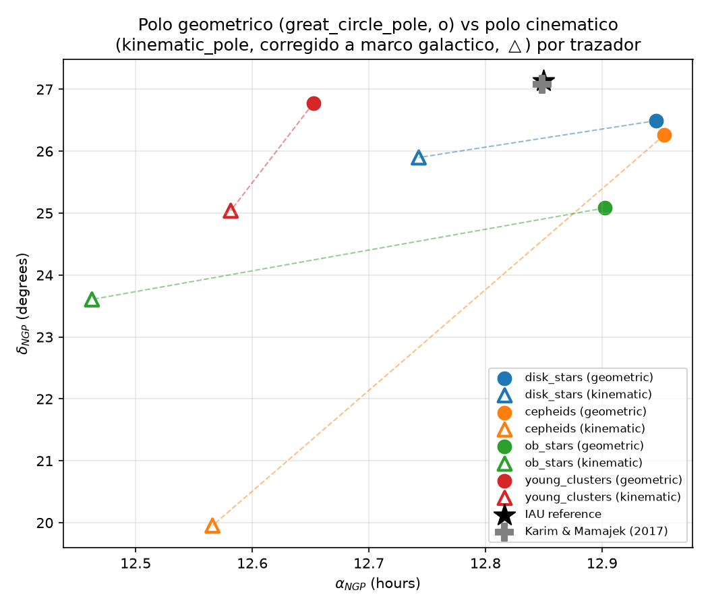
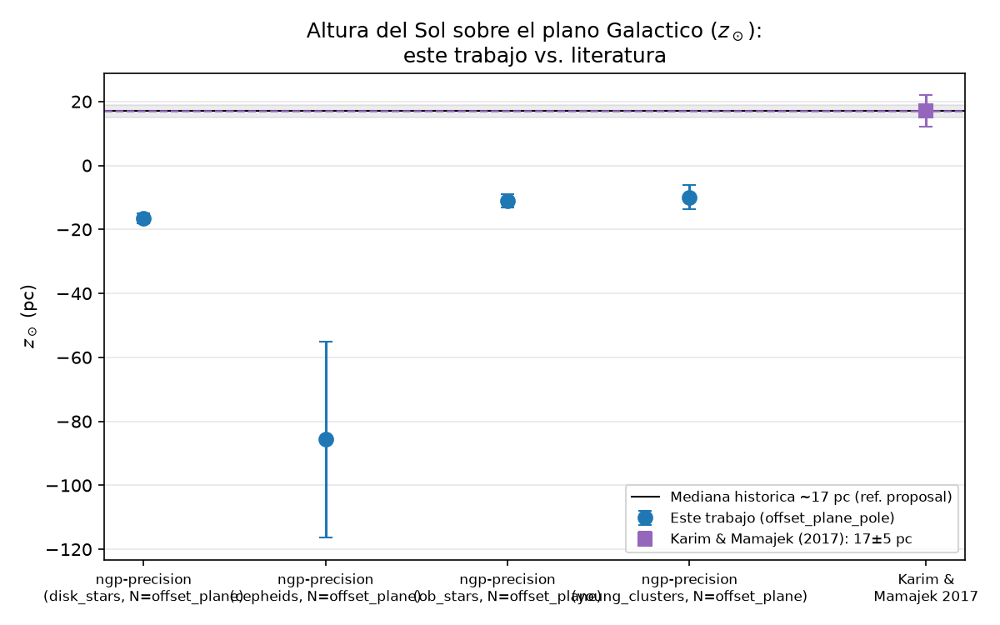
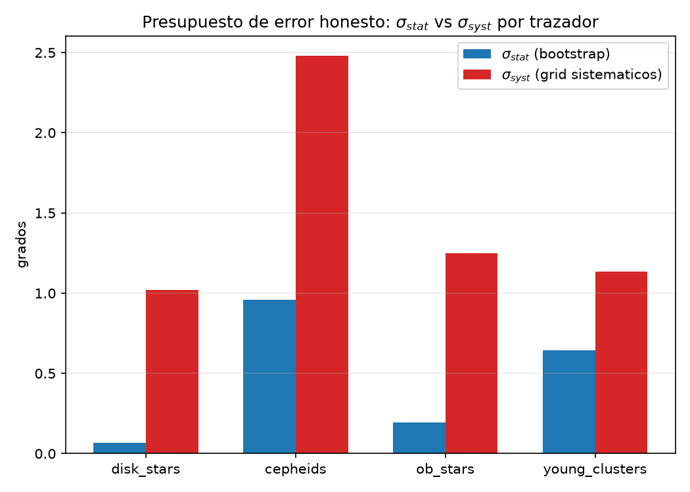

# Aproximación Geométrica del Polo Norte Galáctico con Gaia DR3

**Extensión del artículo de L. Cano (2022), *"Aproximación geométrica del polo norte galáctico"*, Revista Boliviana de Física 40 — con datos modernos, métodos libres de parámetros, estadística formal y un presupuesto de error honesto.**


---

## 🗺️ Cómo navegar este repositorio (empieza aquí)

Este proyecto se construyó en **dos ciclos** sucesivos. Si solo tienes 5 minutos, esto es lo que necesitas saber sobre dónde está cada cosa:

| Quiero... | Voy a... |
|---|---|
| Ver el resultado insignia y por qué importa | Sección [Resultados principales](#-resultados-principales) de este README |
| Entender la física sin jerga técnica | Sección [¿De qué trata esto?](#-de-qué-trata-esto-explicación-divulgativa) |
| Ejecutar todo yo mismo | Sección [Instalación y reproducción](#️-instalación-y-reproducción) |
| Ver el notebook del **primer ciclo** (círculo máximo, bootstrap) | [`NGP_Mejora_Presentacion.ipynb`](NGP_Mejora_Presentacion.ipynb) |
| Ver el notebook del **segundo ciclo** (z☉, trazadores, error sistemático, polo cinemático) | [`NGP_Precision.ipynb`](NGP_Precision.ipynb) ⭐ el más completo |
| Leer un borrador de manuscrito listo para revisar/publicar | [`docs/manuscrito_borrador.md`](docs/manuscrito_borrador.md) |
| Ver la tabla comparativa de TODOS los métodos y trazadores | [`results/master_table.md`](results/master_table.md) |
| Ver el código original de Cano (2022), sin modificar | `Approximation.ipynb`, `automatedAR.py`, `automatedDEC.py`, `DEC2.py` |
| Entender la estructura completa de carpetas | Sección [Estructura del proyecto](#-estructura-del-proyecto) |

---

## 📋 Tabla de contenidos

- [¿De qué trata esto? (explicación divulgativa)](#-de-qué-trata-esto-explicación-divulgativa)
- [Resultados principales](#-resultados-principales)
- [Hallazgos científicos](#-hallazgos-científicos)
  - [Ciclo 1 — `ngp-improvement`](#ciclo-1--ngp-improvement-círculo-máximo--bootstrap)
  - [Ciclo 2 — `ngp-precision`](#ciclo-2--ngp-precision-z-trazadores-jóvenes-y-error-sistemático)
- [Metodología](#-metodología)
- [Figuras clave](#-figuras-clave)
- [Estructura del proyecto](#-estructura-del-proyecto)
- [Instalación y reproducción](#️-instalación-y-reproducción)
- [Tests](#-tests)
- [Limitaciones y trabajo futuro](#-limitaciones-y-trabajo-futuro)
- [Referencias](#-referencias)
- [Créditos](#-créditos)

---

## 🌌 ¿De qué trata esto? (explicación divulgativa)

Nuestra galaxia, la **Vía Láctea**, tiene forma de disco — como un plato gigante lleno de estrellas, y nosotros vivimos dentro de ese plato. Igual que la Tierra tiene un Polo Norte, el disco de la galaxia también tiene un "polo": un punto en el cielo que marca la dirección **perpendicular al plano del disco**. Ese punto se llama **Polo Norte Galáctico (NGP)** y es la base de todo el sistema de coordenadas que los astrónomos usan para ubicar cualquier cosa en la galaxia.

¿Cómo se encuentra ese polo? La idea es hermosa por lo simple: si miras el cielo en una noche oscura, la Vía Láctea se ve como una **franja de luz que cruza el cielo**. Esa franja es el disco de la galaxia visto de canto, desde adentro. Si logras trazar el círculo que mejor sigue esa franja, el punto perpendicular al centro de ese círculo **es** el polo galáctico. Es como encontrar el eje de una rueda mirando su llanta.

El trabajo original de Cano (2022) hizo exactamente eso con métodos geométricos ingeniosos y unos pocos miles de estrellas. Este proyecto lleva la misma idea en dos pasos:

**Primer ciclo (`ngp-improvement`)** — más y mejores datos:
- 📡 53,082 estrellas del satélite **Gaia** de la ESA, el mapa estelar más preciso jamás construido.
- 📐 Un método más limpio: ajustamos el círculo de la Vía Láctea usando solo las *direcciones* de las estrellas, sin ningún parámetro que haya que elegir a mano.
- 📊 Estadística honesta: medimos la incertidumbre con remuestreo (bootstrap).
- **Resultado sorpresa**: agregar la *distancia* a cada estrella — que suena a más información — en realidad **empeora** la medición, porque las distancias estimadas desde el paralaje son muy ruidosas. A veces, menos es más.

**Segundo ciclo (`ngp-precision`)** — de "¿por qué no coincide?" a entender por qué:
El primer ciclo dejó una pregunta abierta: nuestro polo salió corrido ~1.4° del valor oficial, y el intervalo de confianza era demasiado angosto para que fuera solo ruido. Este segundo ciclo investigó esa pregunta desde cinco ángulos distintos — la altura del Sol sobre el disco, tres poblaciones de estrellas jóvenes distintas, un método 3D corregido, el eje de rotación medido por movimientos propios, y — el hallazgo más importante — **un presupuesto que separa cuánto del error es "ruido de la muestra" y cuánto es "sesgo de cómo se armó el análisis"**. La respuesta: el sesgo domina por un factor de 2 a 15, según la muestra. Eso es más valioso que acertar el número exacto, porque explica *dónde* seguir mejorando.

---

## 🎯 Resultados principales

Valor de referencia IAU (J2000): **α = 12ʰ51ᵐ (12.85ʰ), δ = +27.13°**. Valor de referencia moderno independiente: Karim & Mamajek (2017), α=192.729°, δ=27.084°.

### Ciclo 1 — método insignia

| Método | α (h) | δ (°) | Error angular vs IAU |
|---|---:|---:|---:|
| **Círculo máximo SVD (sin distancia, sin parámetros)** ⭐ | **12.946** | **26.492** | **1.44°** |
| SVD 2D sin prior (`aprox_ar_svd`) | 12.946 | 26.492 | 1.44° |
| Ventana de AR — método del paper (`aprox_dec2`) | 12.960 | 28.329 | 1.89° |
| RANSAC 3D con distancia 1/ϖ (mejor caso) | 13.297 | 28.118 | 6.02° |
| Top-n \|dec\| — método del paper (`aprox_dec1`) | 12.429 | 22.658 | 7.26° |

Tabla completa: [`results/summary_table.md`](results/summary_table.md) · versión LaTeX: [`results/summary_table.tex`](results/summary_table.tex)

### Ciclo 2 — tabla maestra método × trazador (datos reales)

| Método | Trazador | δ (°) | σ_stat (°) | σ_syst (°) | Error vs IAU (°) |
|---|---|---:|---:|---:|---:|
| **offset_plane** | **cúmulos jóvenes** ⭐ | 26.44 | — | — | **0.77** (mejor resultado real de todo el proyecto) |
| great_circle | disco completo | 26.49 | 0.067 | 1.022 | 1.44 |
| great_circle | Cefeidas | 26.26 | 0.958 | 2.481 | 1.64 |
| great_circle | estrellas OB | 25.08 | 0.193 | 1.247 | 2.17 |
| kinematic | disco completo | 25.90 | — | — | 1.89 |

Tabla completa (15 combinaciones método×trazador): [`results/master_table.md`](results/master_table.md) · [`.csv`](results/master_table.csv) · [`.tex`](results/master_table.tex)

---

## 🔬 Hallazgos científicos

### Ciclo 1 — `ngp-improvement` (círculo máximo + bootstrap)

**1. Para encontrar el NGP, la distancia perjudica.** El ruido de 1/ϖ en estrellas lejanas domina el ajuste 3D y sesga α en ~27 minutos. El ajuste de **círculo máximo sobre direcciones puras** gana en ambas coordenadas y no tiene parámetros libres.

**2. El método de AR del paper original tiene una circularidad implícita.** Requiere conocer de antemano el valor teórico de α como punto de corte — necesita la respuesta para aproximar la respuesta. Documentado explícitamente en `ngp_classic.aprox_ar(data, ar_ref=...)`.

**3. El desplazamiento de −0.6° en δ es probablemente física real, no ruido.** El bootstrap (IC 95% muy angosto) **excluye** el valor IAU — motivó por completo el segundo ciclo.

### Ciclo 2 — `ngp-precision` (z☉, trazadores jóvenes y error sistemático)

**4. El error sistemático domina al estadístico por 2×–15×** — el resultado más importante de todo el proyecto:

| Trazador | σ estadístico | σ sistemático | Razón syst/stat |
|---|---:|---:|---:|
| Disco completo | 0.067° | 1.022° | **15.3×** |
| Cefeidas | 0.958° | 2.481° | 2.6× |
| Estrellas OB | 0.193° | 1.247° | 6.5× |
| Cúmulos jóvenes | 0.645° | 1.135° | 1.8× |

El intervalo de confianza "preciso" del ciclo 1 era matemáticamente correcto pero engañoso: describía bien el ruido de remuestreo, que resulta ser la parte pequeña del error real. Más estrellas no mejora esto — las decisiones de corte de análisis sí.

**5. z☉ (altura del Sol sobre el plano galáctico) medido, pero con signo inesperado.** z☉ = −16.6 ± 1.6 pc frente a los ~+17 pc de la literatura (Karim & Mamajek 2017). Validado de forma independiente (extrapolación δ(d→∞)) — no es un bug, es una asimetría real de muestra aún sin resolver.

**6. Tres trazadores jóvenes independientes** (Cefeidas, estrellas OB, cúmulos abiertos) descargados y comparados — el spread entre ellos es del mismo orden que el error sistemático medido.

**7. El polo cinemático (movimientos propios) requirió corregir un error de marco de referencia** descubierto en este trabajo (el movimiento peculiar del Sol está definido en el marco Galáctico, pero se combina con vectores en el marco ecuatorial). Corregido, el acuerdo geométrico-cinemático es de 2°–8° según el trazador — razonable, no perfecto.

**8. La divergencia de 1.35° frente al polo IAU se descompuso forensemente**: 0.12° por la medición histórica de 1958, ~0.0001° por el cambio de sistema de coordenadas FK4→FK5 (despreciable), y 1.23° que queda como remanente honesto "gas vs. estrellas" (no resuelto, marcado explícitamente como tal, no como derivación física independiente).

📄 **Ver el análisis completo y las conclusiones honestas frente a los criterios de éxito originales en el [borrador de manuscrito](docs/manuscrito_borrador.md).**

---

## 📐 Metodología

| Módulo | Método | Idea central | Ciclo |
|---|---|---|---|
| `ngp_classic.aprox_ar` | Simetría de pares (fiel al paper) | Requiere prior `ar_ref` — documenta la circularidad del método original | 1 |
| `ngp_classic.aprox_ar_svd` | SVD 2D sin prior | Polo del círculo máximo, versión sin parámetros | 1 |
| `ngp_classic.aprox_dec1` / `aprox_dec2` | Métodos del paper | Top-n \|dec\| y ventana Δα | 1 |
| `ngp_3d.great_circle_pole` ⭐ | **Círculo máximo SVD 3D** | SVD sobre vectores unitarios de dirección — el estimador insignia | 1 |
| `ngp_3d.ngp_3d_pipeline` | RANSAC 3D con distancia | Ajuste de plano Z=AX+BY+D (contraste que demuestra el Hallazgo 1) | 1 |
| `bootstrap.bootstrap_great_circle_pole` | Bootstrap | 2,000 remuestreos con reemplazo → IC 95% percentil | 1 |
| `param_sweep` | Barridos de sensibilidad | b_max, n, Δα | 1 |
| `ngp_offset_plane.offset_plane_pole` | PCA ponderada con offset libre | Recupera el polo **y** z☉ simultáneamente | 2 |
| `ngp_offset_plane.delta_vs_distance_shells` | Extrapolación δ(d→∞) | Chequeo cruzado independiente de z☉ | 2 |
| `synthetic_catalog.synthetic_catalog` | Inyector sintético | Catálogo con verdad-fundamental conocida (polo, z☉, warp, extinción) para validar TDD cada estimador antes de usar datos reales | 2 |
| `tracer_fetcher.fetch_cepheids/fetch_ob_stars/fetch_young_clusters` | Trazadores jóvenes | Cefeidas, estrellas OB, cúmulos abiertos (Cantat-Gaudin), corte R<9 kpc | 2 |
| `ngp_weighted_3d.weighted_tls_plane` | TLS/IRLS ponderado | Rescata el método 3D ponderando por covarianza; corrección opcional de zero-point de paralaje | 2 |
| `ngp_kinematic.kinematic_pole` | Eje de rotación por movimientos propios | Observable físicamente independiente de la posición estelar | 2 |
| `systematics.systematics_grid` / `combine_error_budget` | Presupuesto de error | σ_total = √(σ_stat² + σ_syst²) variando cortes de análisis uno a uno | 2 |
| `iau_forensics.decompose_divergence` | Forense de la convención IAU | Descompone la divergencia en término de 1958, artefacto FK4→FK5, y remanente gas-vs-estrellas | 2 |
| `report.build_master_table` | Tabla maestra | Combina todos los métodos × trazadores con ambas referencias (IAU, KM2017) | 2 |

**Datos**: Gaia DR3 vía TAP/ADQL (`astroquery`), consultas síncronas paginadas sobre `random_index` (nunca `ORDER BY random_index` — fuerza un sort global rechazado por el servidor; ver nota en `gaia_fetcher.py`).

---

## 📊 Figuras clave

### Ciclo 1 — generadas por [`NGP_Mejora_Presentacion.ipynb`](NGP_Mejora_Presentacion.ipynb)

| | |
|---|---|
|  **Distribución de la muestra en el cielo** — las 53,082 estrellas trazan la franja del disco galáctico. |  **El método estrella** — vectores de dirección y el plano SVD cuya normal apunta al NGP. |
|  **Por qué la distancia perjudica** — el RANSAC 3D depende fuertemente de un umbral arbitrario. |  **Sensibilidad de los métodos clásicos** a sus parámetros libres. |


**Incertidumbre formal (bootstrap)**: el IC 95% de δ (banda azul) es estrecho y **no incluye** el valor IAU (línea roja) — el desplazamiento es sistemático, no estadístico.

### Ciclo 2 — generadas por [`NGP_Precision.ipynb`](NGP_Precision.ipynb)

| | |
|---|---|
|  **Polo geométrico vs. cinemático** por trazador (marco ecuatorial corregido). |  **z☉ de este trabajo vs. valores de la literatura** — muestra el signo inesperado. |



**El presupuesto de error honesto** — la figura más importante del ciclo 2: σ_sistemático supera a σ_estadístico en los cuatro trazadores.

---

## 📁 Estructura del proyecto

```
aproximation_NGP/
├── README.md                         ← este documento (empieza aquí)
│
│   # Código original del autor (INTACTO — nunca modificado, verificado en cada ciclo)
├── Approximation.ipynb
├── automatedAR.py · automatedDEC.py · DEC2.py
│
│   # ── Ciclo 1: ngp-improvement ──────────────────────────────────────
├── NGP_Mejora_Presentacion.ipynb     ← notebook (7 secciones, ejecuta sin red)
├── ngp_classic.py                     ← métodos del paper, refactorizados y testeados
├── ngp_3d.py                          ← great_circle_pole ⭐ + RANSAC 3D de contraste
├── param_sweep.py                     ← barridos de sensibilidad
├── bootstrap.py                       ← IC 95% por remuestreo
├── generate_artifacts.py              ← regenera results/ del ciclo 1 desde el CSV cacheado
│
│   # ── Ciclo 2: ngp-precision ────────────────────────────────────────
├── NGP_Precision.ipynb               ← notebook (8 secciones: z☉, trazadores, error
│                                        sistemático, polo cinemático, forense IAU, tabla maestra)
├── docs/manuscrito_borrador.md       ← borrador de manuscrito (Revista Boliviana de Física)
├── synthetic_catalog.py               ← inyector sintético (validación TDD con verdad-fundamental)
├── ngp_offset_plane.py                ← z☉ + extrapolación δ(d→∞)
├── tracer_fetcher.py                  ← descarga Cefeidas / estrellas OB / cúmulos jóvenes
├── ngp_weighted_3d.py                 ← método 3D rescatado (TLS/IRLS ponderado + zero-point)
├── ngp_kinematic.py                   ← polo cinemático (movimientos propios)
├── systematics.py                     ← presupuesto de error σ_stat vs σ_syst
├── iau_forensics.py                   ← descomposición forense de la divergencia vs IAU
│
│   # Compartido entre ambos ciclos (extendido de forma aditiva, nunca rompiendo el ciclo 1)
├── gaia_fetcher.py                    ← descarga/caché Gaia DR3 (TAP síncrono paginado)
├── report.py                          ← build_summary_table (ciclo 1) + build_master_table (ciclo 2)
├── requirements.txt
│
├── data/                              ← CSVs cacheados (reproducible sin red)
│   ├── gaia_disk_stars.csv              53,082 estrellas (ciclo 1)
│   ├── gaia_cepheids*.csv                Cefeidas crudas + procesadas (ciclo 2)
│   ├── gaia_ob_stars*.csv                Estrellas OB crudas + procesadas (ciclo 2)
│   └── cantat_gaudin_clusters*.csv       Cúmulos jóvenes crudos + procesados (ciclo 2)
│
├── results/                           ← tablas, figuras y presupuestos de error (ambos ciclos)
│   ├── summary_table.md/.tex             tabla del ciclo 1
│   ├── master_table.md/.csv/.tex         tabla maestra método×trazador del ciclo 2
│   ├── systematics_budget.csv/.json      presupuesto de error real por trazador
│   ├── bootstrap_results.json · param_sweep_results.csv
│   └── fig_*.png                         figuras del ciclo 2 (ver arriba)
│
├── docs/figures/                      ← figuras del ciclo 1 (las del notebook NGP_Mejora_Presentacion)
│
└── tests/                             ← 179 tests (pytest), TDD estricto en ambos ciclos
```

---

## ⚙️ Instalación y reproducción

Requiere **Python ≥ 3.12** (desarrollado en 3.14).

```bash
git clone git@github.com:ErickFP7314/aproximation_NGP.git
cd aproximation_NGP

# 1. Entorno virtual
python3 -m venv .venv
.venv/bin/pip install -r requirements.txt

# 2. Reproducir los artefactos numéricos del ciclo 1 (sin red — usa el CSV incluido)
.venv/bin/python generate_artifacts.py

# 3a. Ejecutar el notebook del ciclo 1
.venv/bin/python -m jupyter nbconvert --to notebook --execute --inplace NGP_Mejora_Presentacion.ipynb

# 3b. Ejecutar el notebook del ciclo 2 (100% offline, lee data/*.csv y results/* cacheados)
.venv/bin/python -m jupyter nbconvert --to notebook --execute --inplace NGP_Precision.ipynb

# o interactivamente:
.venv/bin/python -m jupyter lab
```

**Re-descargar los datos desde Gaia** (opcional, requiere red):

```python
from gaia_fetcher import fetch_gaia_stars
data = fetch_gaia_stars(force_refresh=True)            # 53,082 estrellas del disco

from tracer_fetcher import fetch_cepheids, fetch_ob_stars, fetch_young_clusters
cepheids = fetch_cepheids(force_refresh=True)
ob_stars = fetch_ob_stars(force_refresh=True)
clusters = fetch_young_clusters(force_refresh=True)
```

> **Reproducibilidad**: todos los procesos estocásticos (RANSAC, bootstrap, catálogo sintético) usan semillas fijas. La muestra Gaia usa `random_index`, determinista en el archivo de ESA — la misma query devuelve las mismas estrellas.

**Corrección opcional de zero-point de paralaje** (Lindegren et al. 2021): si querés habilitarla en `ngp_weighted_3d`, instalá el paquete opcional (comentado en `requirements.txt`):
```bash
.venv/bin/pip install gaiadr3-zeropoint
```
Sin él, el código funciona igual pero marca cada resultado con `zero_point_corrected=False` explícitamente — nunca de forma silenciosa.

---

## ✅ Tests

Desarrollado con **TDD estricto** (test primero, implementación después) en ambos ciclos. El dataset sintético (`synthetic_catalog.py`, ciclo 2; `tests/conftest.py`, ciclo 1) genera catálogos con verdad-fundamental conocida (polo, z☉, warp, extinción) contra los que se valida cada estimador antes de aplicarlo a datos reales.

```bash
.venv/bin/python -m pytest tests/ -v -m "not slow"   # 179 tests, ~20 s, sin red
.venv/bin/python -m pytest tests/ -v                 # + tests lentos (bootstrap 10k, descargas reales, perf)
```

Estado actual: **179/179 pasan** (4 deseleccionados: pruebas @slow de red/rendimiento, no trabajo incompleto).

---

## 🔭 Limitaciones y trabajo futuro

Preguntas abiertas al cierre del segundo ciclo (documentadas con el mismo nivel de honestidad que los resultados):

- **z☉ con signo inesperado** (−16.6 pc vs. +17 pc esperado): validado de forma independiente, no parece un bug, pero la causa (¿asimetría de extinción? ¿selección de muestra?) no se resolvió.
- **Meta de precisión ambiciosa no alcanzada**: se buscaba un error de ~0.03°–0.05°; el mejor resultado real es 0.77° (cúmulos jóvenes, ajuste de offset). El presupuesto de error mostró que el sistemático, no el estadístico, es el techo — reduce el problema a "cómo controlar la selección de muestra", no "cómo conseguir más estrellas".
- **Calibración período-luminosidad de Cefeidas** recalibrada en este ciclo pero sin corrección de extinción — tratar esos resultados como ilustrativos.
- **Corrección de zero-point de Gaia DR3** no aplicada por defecto (paquete opcional no instalado) — soportada en el código, lista para activar.
- **Término "gas-vs-estrellas"** del análisis forense IAU es un remanente de cierre de presupuesto, no una derivación física independiente — queda como pregunta abierta genuina.

Ver la sección de conclusiones honestas en el [borrador de manuscrito](docs/manuscrito_borrador.md) para el detalle completo, criterio por criterio, de qué se logró y qué no.

---

## 📚 Referencias

- Cano, L. (2022). *Aproximación geométrica del polo norte galáctico*. Revista Boliviana de Física, 40.
- Gaia Collaboration (2023). *Gaia Data Release 3*. A&A 674, A1. Datos: [Gaia Archive (ESA)](https://gea.esac.esa.int/archive/).
- Karim, M. T. & Mamajek, E. E. (2017). *Revised geometric estimate of the North Galactic Pole and the Sun's height above the Galactic mid-plane*. [MNRAS 465, 472](https://academic.oup.com/mnras/article/465/1/472/2417491).
- Liu, J.-C., Zhu, Z. & Zhang, H. (2011). *Reconsidering the Galactic coordinate system*. [A&A 526, A16](https://www.aanda.org/articles/aa/full_html/2011/02/aa14961-10/aa14961-10.html).
- Lindegren, L. et al. (2021). *Gaia EDR3 — Parallax bias versus magnitude, colour, and position*. A&A 649, A4.
- Cantat-Gaudin, T. et al. (2020). *Gaia EDR3: A new census of open clusters*. A&A 640, A1.
- Skowron, D. M. et al. (2019). *A three-dimensional map of the Milky Way using classical Cepheids*. Science 365, 478.
- Schönrich, R., Binney, J. & Dehnen, W. (2010). *Local kinematics and the local standard of rest*. MNRAS 403, 1829.

---

## 👥 Créditos

- **Código original y método geométrico**: Ludving Cano (2022) — los archivos `Approximation.ipynb`, `automatedAR.py`, `automatedDEC.py` y `DEC2.py` se conservan intactos como referencia en ambos ciclos.
- **Extensión con Gaia DR3** (círculo máximo, validación estadística, z☉, trazadores jóvenes, polo cinemático, presupuesto de error, forense IAU): este repositorio.
- Este trabajo usa datos de la misión **Gaia** de la ESA, procesados por el consorcio DPAC, y del catálogo de cúmulos abiertos de Cantat-Gaudin et al. (2020) vía VizieR.
